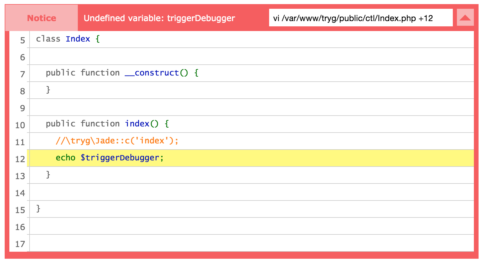

# tryg

A Minimal PHP/node MVC framework 

[](https://packagist.org/packages/acidjazz/tryg)
[](https://packagist.org/packages/acidjazz/tryg)
[](https://packagist.org/packages/acidjazz/tryg)
[](https://packagist.org/packages/acidjazz/tryg)
[](https://gitter.im/acidjazz/tryg?utm_source=badge&utm_medium=badge&utm_campaign=pr-badge&utm_content=badge)

### features

* Visual debugger

* Complete [Jade](https://github.com/jadejs/jade) support
* Complete [Stylus](https://github.com/stylus/stylus) support
* Global configuration, parameters available in PHP, Stylus, and Jade
* API endpoint assistance
* Much more I will list later

### what?

tryg is a minimal PHP framework named after [Trygve Reenskaug](http://en.wikipedia.org/wiki/Trygve_Reenskaug), the inventor of the MVC structure.
tryg uses Jade for templating and Stylus for CSS preprocessing, their native versions via sockets.

### installation

1. Install [Composer](https://getcomposer.org/)
2. Install the specified [Packagist](https://packagist.org/packages/acidjazz/tryg) _acidjazz/tryg_
```bash
php ~/composer.phar require acidjazz/tryg
```
3. Copy the bundled setup template
```bash
cp -rp vendor/acidjazz/tryg/site .
```
4. Copy the provided package.json to install the required node modules, then use *npm* to install them
```bash
cp -rp vendor/acidjazz/tryg/package.json .
npm install
```
5. Point your web server to the site/pub/ folder you've copied as the root, you're done!

### Nginx setup

Replace `/var/www/tryg/site/pub` with the location of your setup template 

```nginx
server {

	listen 80;
	root /var/www/tryg/site/pub;
	index index.php;
	server_name tryg;

	location / {
	if (!-e $request_filename) {
		rewrite ^(.*)$ /index.php;
	}

}

	location ~ \.php$ {
		fastcgi_split_path_info ^(.+\.php)(/.+)$;
		fastcgi_pass unix:/var/run/php5-fpm.sock;
		fastcgi_index index.php;
		include fastcgi_params;

		# dev env settings
		fastcgi_param PHP_VALUE "short_open_tag=on \n display_errors=off \n error_reporting=E_ALL";

		# prod env settings
		# fastcgi_param PHP_VALUE "short_open_tag=on \n display_errors=off \n error_reporting=E_ALL";
	}

}
```

### Apache setup

Create a .htaccess in your setup template root folder and make sure mod\_rewrite is activated

```apache
RewriteEngine On
RewriteCond %{REQUEST_FILENAME} !-f
RewriteCond %{REQUEST_FILENAME} !-d
RewriteRule ^(.*)$ index.php
```

### dev notes

refresh our test setup using tryg as a vendor
```bash
sudo pkill node;php ~/composer.phar update;rm -rf site/pub/; cp -rp vendor/acidjazz/tryg/site/ site
```
